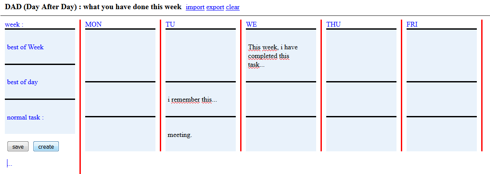

# DAD (Day After Day) : what you have done this week  #

This is this project's goal : remember your tasks and be proud of your work.   
This is an Agile principle : **early victory**. By this way, you can work indefinitely  at your rythm. And if you priorize (best of the week or best of the day) it is very easy to  quickly answer to question : "What have you done this week, or today ? ". Remember, an agile task can't be longer than a day.  
If you are en agile fan, it is easy to modify this script in order to do a sprint kanboard.

You are viewing the **version 1.0**

## Portable Solution ##

This is a simple HTM page (embed CSS and JS), with internal or external lib, as you want. These libs are :   

- jquery, 
- jquery-ui, 
- mustachejs.

### Features ###

1. Use : just open file in your browser (neither need server or database).
2. Storage : data are stored in your localstorage browser : use "save" button (*to access to the recent updated localstorage, file must be reload, reason for wich we don't do this action on the fly*).
3. Export : data may be export in [week-number].json file : use "export" link.
4. Import : data may be import in an other browser, or old data may be reviewed : use "import" link.
5. Clear : you can remove data to have an empty board (becareful, localstorage will also be removed) : use "clear" link.
6. Create : you can add any content : use "create" button, then drag and drop content.
7. Update : just do a right mouse click (*this is in order to avoid conflict beetween suitable jquery and HTML5 contenteditable*) on the content, and edit.
8. Delete : just do a right mouse click on the content, and delete it, replace by empty content.
9. Drag and drop : this is the sortable jquery effect.
10. Word-wrap : css property.
11. Div at the same size : jquery script control.

### Evolution ###

My guests for the Christmas gifts :  

1. A better solution for resolution conflict beetween suitable jquery and HTML5 contenteditable.
2. An immediatly usable update in localstorage on the fly.

